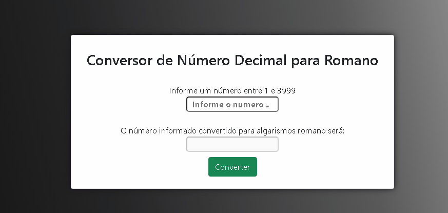

# Projeto-Algarismo-Romano

Este projeto foi criado através de um desafio no qual, ao digitarmos um número entre 1 e 3999, o sistema identifica o número digitado e o converte para algaismo romano.Ele foi produzido com base nas linguagens HTML5,CSS e TypeScript. Esse conversor possui indentificador de erro, ou seja, se for digitado algo fora do parâmetro estabelecido, é enviado um alerta de erro.
